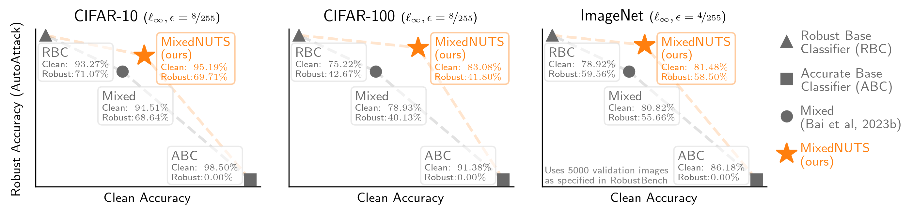

# MixedNUTS: Training-Free Accuracy-Robustness Balance via Nonlinearly Mixed Classifiers

This is the official code implementation of the preprint paper \
*[MixedNUTS: Training-Free Accuracy-Robustness Balance via Nonlinearly Mixed Classifiers](https://arxiv.org/abs/2402.02263)* \
by [Yatong Bai](https://bai-yt.github.io),
[Mo Zhou](https://cdluminate.github.io),
[Vishal M. Patel](https://engineering.jhu.edu/faculty/vishal-patel),
and [Somayeh Sojoudi](https://www2.eecs.berkeley.edu/Faculty/Homepages/sojoudi.html).

**TL;DR:** MixedNUTS balances clean data classification accuracy and adversarial robustness without additional training 
via a mixed classifier with nonlinear base model logit transformations.

<center>
  
</center>


#### Citing our work (BibTeX)

```bibtex
@article{MixedNUTS,
  title={MixedNUTS: Training-Free Accuracy-Robustness Balance via Nonlinearly Mixed Classifiers},
  author={Bai, Yatong and Zhou, Mo and Patel, Vishal M. and Sojoudi, Somayeh},
  journal={arXiv preprint arXiv:2402.02263},
  year={2024}
}
```


## Getting Started

### Model Checkpoints

MixedNUTS is a training-free method that has no additional neural network components other than its base classifiers.

All robust base classifiers used in the main results of our paper are available on [RobustBench](https://robustbench.github.io)
and can be downloaded automatically via the RobustBench API.

Here, we provide the download links to the standard base classifiers used in the main results.

| Dataset   | Link  |
|-----------|-------|
| CIFAR-10  | [Download](http://172.233.227.28/base_models/cifar10/cifar10_std_rn152.pt)    |
| CIFAR-100 | [Download](http://172.233.227.28/base_models/cifar100/cifar100_std_rn152.pt)  |
| ImageNet  | [Download](https://dl.fbaipublicfiles.com/convnext/convnextv2/im22k/convnextv2_large_22k_224_ema.pt)  |

After downloading the accurate base classifiers, create a `base_models` directory and organize as follows:
```
base_models
│
└───cifar10
│   └───cifar10_std_rn152.pt
│   
└───cifar100
    └───cifar100_std_rn152.pt
│   
└───imagenet
    └───imagenet_std_convnext_v2-l_224.pt
```

<span style="color:gray"> The CIFAR-10 and -100 accurate base classifiers are fine-tuned from
[BiT](https://github.com/google-research/big_transfer) checkpoints.
The ImageNet accurate base classifier is from the
[ConvNeXt-V2](https://github.com/facebookresearch/ConvNeXt-V2) repository. </span>

### Environment

Run the following to install the environment:
```
conda env create -f environment.yml
```

There are two additional pip packages that are not present in pypi and need to be manually installed via the following:

```
conda activate nlmc
pip install git+https://github.com/fra31/auto-attack
pip install git+https://github.com/RobustBench/robustbench.git
```

### Replicating Our Results

CIFAR-10:
```
python run_robustbench.py --root_dir base_models --dataset_name cifar10 \
    --rob_model_name Peng2023Robust --std_model_arch rn152 --map_type best \
    --adaptive --n_examples 10000 --batch_size_per_gpu 40  --disable_nonlin_for_grad
```

CIFAR-100:
```
python run_robustbench.py --root_dir base_models --dataset_name cifar100 \
    --rob_model_name Wang2023Better_WRN-70-16 --std_model_arch rn152 --map_type best \
    --adaptive --n_examples 10000 --batch_size_per_gpu 40 --disable_nonlin_for_grad
```

ImageNet:
```
python run_robustbench.py --root_dir base_models --dataset_name imagenet \
    --rob_model_name Liu2023Comprehensive_Swin-L --std_model_arch convnext_v2-l_224 --map_type best \
    --adaptive --n_examples 5000 --batch_size_per_gpu 20 --disable_nonlin_for_grad
```

### Building MixedNUTS with Your Base Classifiers

Please refer to `scripts.sh` for the workflow of constructing MixedNUTS.


## Third-party Code

`adaptive_autoattack.py`, `autopgd_base.py`, and `fab_pt.py` in `adaptive_autoattack`
are modified based on [AutoAttack](https://github.com/fra31/auto-attack).

`robust_bench.py` is modified based on [RobustBench](https://github.com/RobustBench/robustbench).
